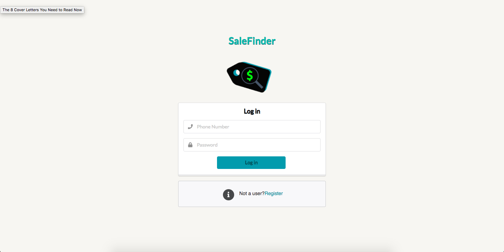
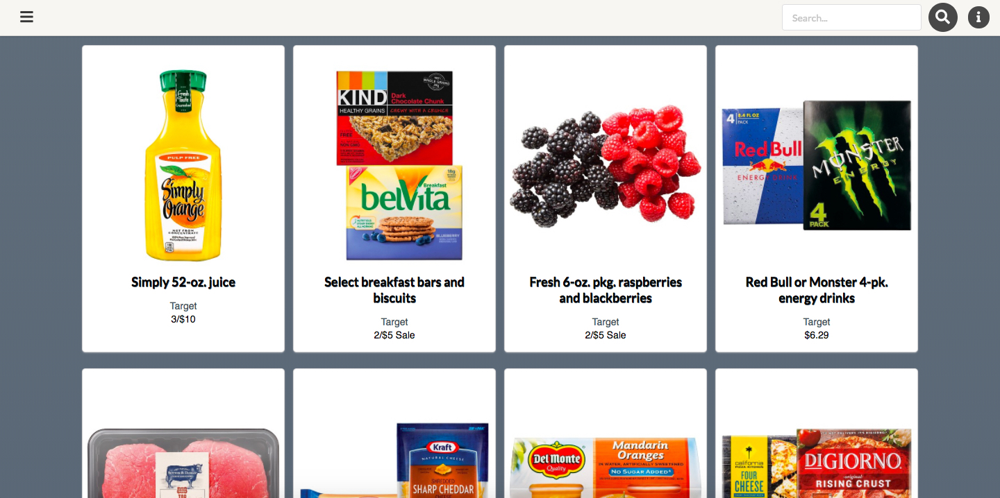
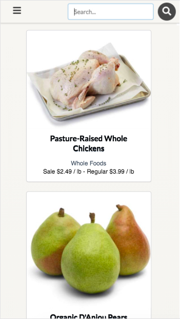
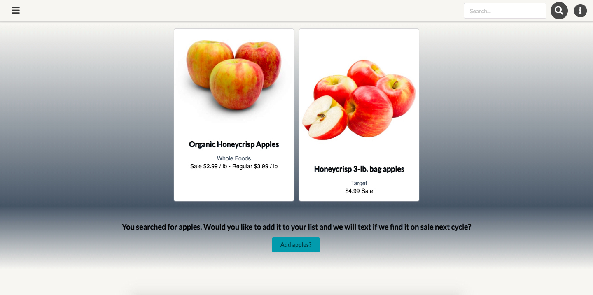
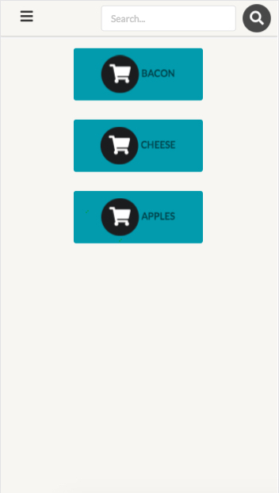

# SaleFinder-Server

*[Justin Hays](https://github.com/just-hey "Justin Hays' GitHub")*

SaleFinder is a full stack React App that allows users to register and have weekly text messages sent to them about what products are on sale.  SaleFinder utilizes web scraping to pull sale items from the weekly ads from the following stores:
- *Whole Foods Market* _(uses zip code)_
- *Target*
- *Kroger* _(uses zip code)_

SaleFinder was created in 2 weeks.

### Deployed here: http://salefinder.surge.sh/#/
#### Frontend GitHub: https://github.com/just-hey/SaleFinder-Client
#### Backend GitHub: https://github.com/just-hey/SaleFinder-Server
#### Web Scrapers GitHub: https://github.com/just-hey/Grocery-Crawlers

## Features
- Managed state through React components
- Send and retrieve authenticated data from server using REST API
- Register and Login via jwt and bcrypt

## Technologies
#### Frontend
- React.js
- Semantic-UI-React
- JSX
- JavaScript
- AJAX/axios

#### Backend
- Puppeteer
- Node.js
- Express.js
- Knex.js
- PostgreSQL
- Authentication via jwt and bcrypt
- Custom RESTful API
- JavaScript

## Screenshots

### Splash Page:

### Desktop Browse View:

### Mobile Browse View:

### Add an Item to Cart:

### View Items in Cart:

